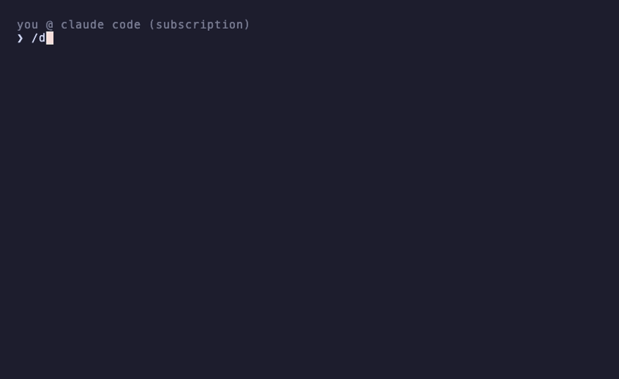
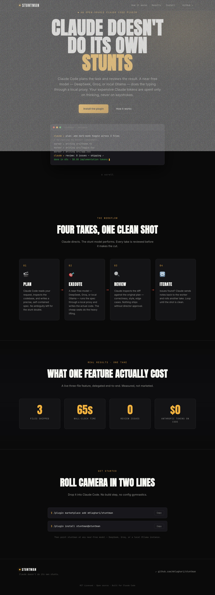
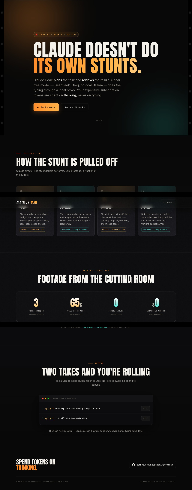

# 🎬 stuntman

**Claude doesn't do its own stunts.** · [Website](https://mhlaghari.github.io/stuntman/)

Claude Code plans the scene and reviews the take. A near-free model — DeepSeek,
Gemini, Groq, a local Ollama, whatever — takes the hits. Your expensive
subscription tokens go only where intelligence actually matters.



```
  PLAN                EXECUTE               REVIEW              ITERATE
  Claude (sub) ──▶    stunt double ──▶      Claude (sub) ──▶    feedback ↩
  reads the code,     headless Claude       reads the diff,     same worker
  writes a spec       Code instance,        runs the tests      session resumes,
  with zero open      any model via         itself — trusts     fixes in place.
  decisions           a local proxy         nothing             max 2 rounds,
                                                                then Claude
                                                                takes over
```

## The pain point

You pay for a Claude subscription. And then you watch Opus burn through your
usage limits **typing boilerplate** — CRUD endpoints, test scaffolding,
mechanical refactors. Work a model that costs fractions of a cent does just
fine.

The obvious fix — "just use a cheaper model" — fails, because cheap models
are bad at exactly the two things that matter: **deciding what to build** and
**judging whether it's right**. Hand DeepSeek a vague task and you get
confident garbage. Hand it a spec with every decision already made, and it
executes beautifully.

So split the loop:

- **Claude thinks.** It explores your codebase and writes a spec with zero
  design decisions left open. This is where the expensive tokens earn their keep.
- **A free model types.** A second, headless Claude Code instance — same
  harness, same tools, different brain — executes the spec autonomously.
- **Claude checks.** It reads the diff, runs the tests itself, and sends
  review feedback back into the *same worker session* until it passes.

No API credits. The orchestrator runs on the subscription you already pay
for; the worker runs through your own keys on a near-free backend (several
have free tiers).

## The trick

Claude Code respects `ANTHROPIC_BASE_URL`. Point it at a local
Anthropic-compatible proxy ([free-claude-code](https://github.com/Alishahryar1/free-claude-code),
17 backends supported) and you get a fully functional Claude Code whose brain
is any model you want. Run that headlessly (`claude -p --output-format json`)
and your main Claude session can spawn it, parse its results, and drive it
through review rounds (`--resume <session_id>`) — like a senior engineer
managing a very fast, very cheap contractor.

The worker gets its own `CLAUDE_CONFIG_DIR`, so it never touches your
subscription's login or session state.

## Field report

First real run, on a real codebase: Claude picked an open item off the
project's backlog, explored the code, and wrote the spec. DeepSeek executed a
3-file change (new feature flag wired through two modules, plus a test) in
**65 seconds**. Claude's review found zero issues, the full test suite passed,
lint clean. Total Anthropic tokens spent on implementation: **zero**.

## The benchmark: Opus DIY vs. the stunt double

Same task, two paths: build a landing page for this repo (dark cinematic
design, 4-step workflow section, stats, install commands — a real frontend
brief). Path A: Opus does everything itself. Path B: Opus writes the spec,
DeepSeek executes, Opus reviews. Identical brief, measured identically from
`--output-format json` usage.

| | Opus DIY | stuntman |
|---|---|---|
| Claude output tokens | **50,955** | **9,737** (8,782 plan + 955 review) |
| API-equivalent Claude cost | **~$4.92** | **~$0.65** |
| Wall-clock | **18 min — never finished** | **~3 min** (63s execution) |
| Review verdict | n/a (it was the builder) | PASS, zero iterations |
| Result | the slightly nicer page | ~90% of the page, $0 on implementation |

That "never finished" is real: after building the page in ~7 minutes, Opus
spent 11 more minutes verifying its own work in a browser — and deadlocked
clicking its own copy button (`navigator.clipboard.writeText` blocks forever
in a permissionless headless browser). The page was already done. That
self-verification spiral is exactly the expensive-model behavior you're
paying for by the token — and exactly what the harness moves off your bill.

**5.2× the Claude tokens, 7.6× the cost, 6× the wall-clock — for a margin
best described as taste.** And the punchline: the Opus page was the better
artifact, so it's [this repo's actual website](https://mhlaghari.github.io/stuntman/)
— built by the benchmark that proves you usually don't need it.

| DeepSeek (63s, $0 Claude tokens) | Opus (18 min, ~$4.92) |
|---|---|
|  |  |

*(Screenshots taken with reveal animations force-disabled; the gray wash on
DeepSeek's hero is the screenshot hack blowing its 4%-opacity film grain to
100% — the real page is clean.)*

## Install

Prerequisites:

1. [Claude Code](https://claude.com/claude-code) with a subscription (the orchestrator).
2. [free-claude-code](https://github.com/Alishahryar1/free-claude-code) (the proxy):
   ```bash
   uv tool install free-claude-code
   fcc-config   # pick your backend + paste your key (DeepSeek, OpenRouter, Groq, Ollama…)
   fcc-server   # leave it running (localhost:8082)
   ```

### Option A — Claude Code plugin (recommended)

Inside Claude Code:

```
/plugin marketplace add mhlaghari/stuntman
/plugin install stuntman@stuntman
```

### Option B — plain install script

```bash
git clone https://github.com/mhlaghari/stuntman && cd stuntman && ./install.sh
```

Copies the `/delegate` skill to `~/.claude/skills/` and the `stunt` worker
wrapper to `~/.local/bin/`.

## Usage

From your normal (subscription) Claude Code session, in any project:

```
/delegate add input validation to the upload endpoint
```

What happens:

1. Claude explores the code and writes a self-contained spec (you'll see it).
2. The stunt double executes it headlessly — file edits, running tests, the lot.
3. Claude diffs the work against the spec and runs verification itself.
4. Problems go back to the same worker session as review feedback. After two
   failed rounds, Claude declares the task "heavy" and finishes it personally —
   which is exactly the work you bought the subscription for.

## Choosing your stunt double

The proxy decides which model the worker uses (`fcc-config`). To pin a
specific model per delegation, set:

```bash
export STUNTMAN_MODEL="anthropic/deepseek/deepseek-v4-flash"   # any id from /v1/models
```

Good stunt doubles, roughly in order of bang-per-buck:

| Backend | Why |
|---|---|
| DeepSeek | Strong coder, absurdly cheap |
| Groq / Cerebras | Fast open models, free tiers |
| NVIDIA NIM | Free tier, solid open models |
| Gemini Flash | Cheap, large context |
| Ollama / LM Studio | Literally free, fully local |

## Why the spec quality matters

This is the one non-obvious lesson: **the harness works because the spec
leaves the worker zero design decisions.** Exact files, exact signatures,
exact test to add, exact verification commands. Weak models executing great
instructions beat strong models executing vague ones — and writing great
instructions is precisely what your expensive model is for.

## Security note

The worker runs with `--dangerously-skip-permissions` so it can edit files
and run tests unattended. That means it can execute arbitrary commands in
your project directory. Only delegate inside repos you trust, and prefer
delegating from a clean branch — review then covers exactly the worker's
changes, and a bad take is one `git checkout` away from the cutting-room floor.

## FAQ

**Does this burn my Anthropic credits?**
No. The worker talks to your local proxy with your own backend keys. Your
subscription pays only for the plan and review phases — the thinking.

**Is the worker really Claude Code?**
Yes — same agentic harness, tools, and editing loop. Only the model behind
`/v1/messages` changes. That's why it can be driven with `-p`, `--resume`,
and `--output-format json` like any other Claude Code instance.

**What if the worker produces garbage?**
That's the point of the review phase. Claude trusts nothing: it reads the
diff and runs the tests itself. Garbage gets caught, fed back, and fixed —
or Claude takes over.

**Can I use a different proxy?**
Anything that speaks the Anthropic Messages API works. Edit `bin/stunt` and
point `ANTHROPIC_BASE_URL` wherever you like.

## Credits

- [free-claude-code](https://github.com/Alishahryar1/free-claude-code) by
  Alishahryar1 — the proxy that makes the trick possible.
- Built with (and by) Claude Code.

## License

MIT
