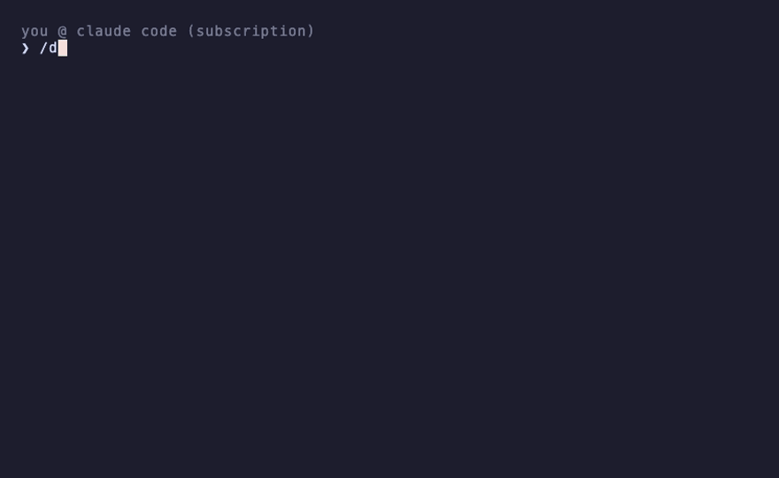
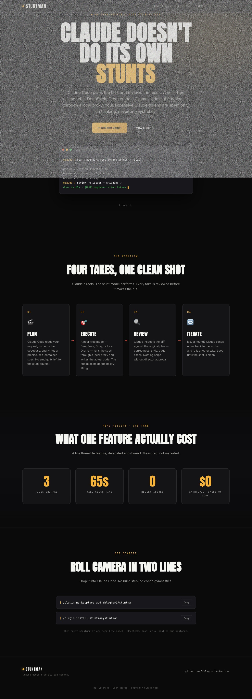
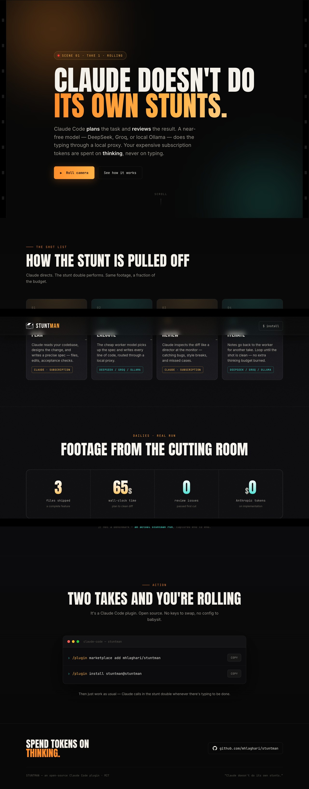
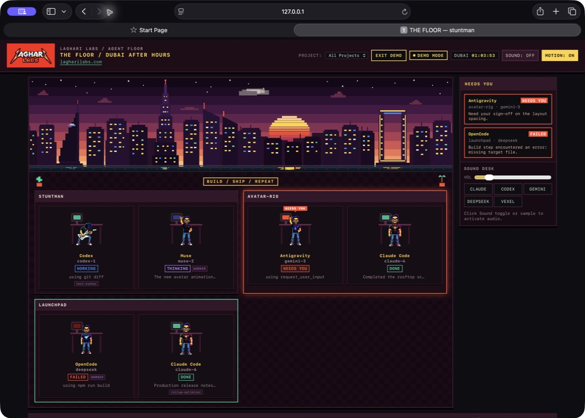

# 🎬 stuntman

**Your coding agent doesn't do its own stunts.** · [Website](https://mhlaghari.github.io/stuntman/)

Claude Code **or Codex** plans the scene and reviews the take. A worker takes the
hits — DeepSeek, Groq, a local Ollama, **or the flat-rate subscriptions you
already pay for**: OpenAI's Codex, Google's Antigravity, Meta's Muse Code.
Keep your orchestrator focused on planning and review. Choose the executor
independently with `STUNTMAN_WORKER`.



```
  PLAN                EXECUTE               REVIEW              ITERATE
  Claude (sub) ──▶    stunt double ──▶      Claude (sub) ──▶    feedback ↩
  reads the code,     any of 5 backends:    reads the diff,     same worker
  writes a spec       proxy · opencode      runs the tests      session resumes,
  with zero open      codex · agy · muse    itself — trusts     fixes in place.
  decisions           (headless, cheap)     nothing             max 2 rounds,
                                                                then Claude
                                                                takes over
```

## Commands

From Claude Code or Codex, in any project. In Claude Code, use the slash
commands below; in Codex, select the Stuntman skill with `$` in CLI or `@`
in the app, or ask for it by name (for example, "Use Stuntman to delegate
this task to opencode").

| Command | What it does | Spans |
|---|---|---|
| **`/delegate <task>`** | The host plans + reviews; a near-free worker executes the spec — five backends: Claude-via-proxy, opencode (DeepSeek/Groq/Ollama/Grok/Kimi), Codex, Antigravity (`agy`), Muse. | cost |
| **`/relay <task>`** | Preserves progress across usage caps with independent workers and available scheduling. | the rate limit |
| **`/scaffold`** | Stands up a project's self-resuming memory — an `AGENTS.md` or `CLAUDE.md` contract + four living docs (HANDOFF · STATUS · SPEC · STRATEGY). | the context boundary |
| **`/handoff`** | Reads those docs and continues exactly where the last session stopped. | new sessions / `/clear` |
| **`/wiki`** | Builds a "second brain" across a folder of projects — an Obsidian vault + a graphify knowledge graph + a live MCP for cross-project recall. | every project |
| **`/launch`** | Fans out a multi-agent workflow — cited competitor research, market sizing, channel ranking, then pricing + positioning + a week-by-week launch playbook, pressure-tested by adversarial critics — into one Product Success Overview (markdown + HTML). | the blank-page launch |
| **`/usages`** | One board for every stunt double's usage + limits — Claude 5h/7d (live), Codex 5h/weekly (last snapshot), DeepSeek balance (live) — plus a cached `--statusline` segment. | all the subscription dashboards |

| **`/floor`** | Live Vexel board for Claude Code, Codex, and Stuntman workers: status, conversations, and prompting ready tmux sessions. | agents across projects |

Each is detailed in its own section below.

## What's what

Two roles, five backends, shared tools — here is the whole cast:

| Piece | What it is |
|---|---|
| **The orchestrator** | Your current Claude Code or Codex session. It plans specs, reviews diffs, runs the tests. It never types implementation code. |
| **The stunt double** | The headless worker that executes specs. `STUNTMAN_WORKER` picks it: `claude` (default — headless Claude Code via a local proxy), `opencode` (DeepSeek/Groq/Ollama/Grok/Kimi + 75 providers), `codex` (OpenAI's CLI, your ChatGPT sub), `agy` (Google's Antigravity CLI, your Antigravity sub), `muse` (Meta's Muse Code CLI, your Meta sub). `STUNTMAN_MODEL` pins the model. |
| **`bin/stunt`** | The worker wrapper. Two verbs — `stunt exec "<spec>"` and `stunt resume <id> "<feedback>"` — normalized to one JSON shape across all five backends. |
| **`bin/floor` + `bin/floor-hook`** | Local agent board and lifecycle recorder; `bin/stunt` also emits worker events. |
| **`bin/codex-window`** | Local Codex quota snapshot for relay decisions, including freshness and binding windows. |
| **`bin/window`** | Zero-token probe of Claude's 5-hour/weekly usage window (what `/relay` reads). |
| **`bin/usages`** | The cross-subscription usage board (what `/usages` reads; also feeds the status line). |
| **`bin/scaffold` + `bin/wiki`** | Stand up the living-docs memory system and the cross-project second brain. |
| **The living docs** | `HANDOFF.md` (session baton) · `STATUS.md` (board) · `SPEC.md` (contract) · `STRATEGY.md` (why). `/scaffold` writes them, `/handoff` resumes from them. |
| **The Stop hook** | `hooks/handoff-guard.sh` — nudges once when code changed but the living docs didn't, and once a day when a project's vault page drifts stale. Fails open. |

## The pain point

You pay for a Claude subscription. And then you watch Opus burn through your
usage limits **typing boilerplate** — CRUD endpoints, test scaffolding,
mechanical refactors. Work a model that costs fractions of a cent does just
fine.

The obvious fix — "just use a cheaper model" — fails, because cheap models
are bad at exactly the two things that matter: **deciding what to build** and
**judging whether it's right**. Hand DeepSeek a vague task and you get
confident garbage. Hand it a spec with every decision already made, and it
executes beautifully.

So split the loop:

- **Claude thinks.** It explores your codebase and writes a spec with zero
  design decisions left open. This is where the expensive tokens earn their keep.
- **A free model types.** A second, headless Claude Code instance — same
  harness, same tools, different brain — executes the spec autonomously.
- **Claude checks.** It reads the diff, runs the tests itself, and sends
  review feedback back into the *same worker session* until it passes.

No API credits. The orchestrator runs on the subscription you already pay
for; the worker runs through your own keys on a near-free backend (several
have free tiers).

## The trick

Claude Code respects `ANTHROPIC_BASE_URL`. Point it at a local
Anthropic-compatible proxy ([free-claude-code](https://github.com/Alishahryar1/free-claude-code),
17 backends supported) and you get a fully functional Claude Code whose brain
is any model you want. Run that headlessly (`claude -p --output-format json`)
and your main Claude session can spawn it, parse its results, and drive it
through review rounds (`--resume <session_id>`) — like a senior engineer
managing a very fast, very cheap contractor.

The worker gets its own `CLAUDE_CONFIG_DIR`, so it never touches your
subscription's login or session state.

The second trick: **every vendor's flat-rate coding CLI is the same worker in
a different costume.** Codex (`codex exec`), Antigravity (`agy -p`), and Muse
(`muse exec`) all expose run-headless + resume-by-id + JSON output, so
`bin/stunt` normalizes all of them to one contract. If you already pay for
ChatGPT, Antigravity, or Meta, those subscriptions become execution capacity
for your Claude session — and Antigravity's roster alone spans Gemini 3.x,
Claude Sonnet/Opus, and GPT-OSS.

## Field report

First real run, on a real codebase: Claude picked an open item off the
project's backlog, explored the code, and wrote the spec. DeepSeek executed a
3-file change (new feature flag wired through two modules, plus a test) in
**65 seconds**. Claude's review found zero issues, the full test suite passed,
lint clean. Total Anthropic tokens spent on implementation: **zero**.

## The benchmark: Opus DIY vs. the stunt double

Same task, two paths: build a landing page for this repo (dark cinematic
design, 4-step workflow section, stats, install commands — a real frontend
brief). Path A: Opus does everything itself. Path B: Opus writes the spec,
DeepSeek executes, Opus reviews. Identical brief, measured identically from
`--output-format json` usage.

| | Opus DIY | stuntman |
|---|---|---|
| Claude output tokens | **50,955** | **9,737** (8,782 plan + 955 review) |
| API-equivalent Claude cost | **~$4.92** | **~$0.65** |
| Wall-clock | **18 min — never finished** | **~3 min** (63s execution) |
| Review verdict | n/a (it was the builder) | PASS, zero iterations |
| Result | the slightly nicer page | ~90% of the page, $0 on implementation |

That "never finished" is real: after building the page in ~7 minutes, Opus
spent 11 more minutes verifying its own work in a browser — and deadlocked
clicking its own copy button (`navigator.clipboard.writeText` blocks forever
in a permissionless headless browser). The page was already done. That
self-verification spiral is exactly the expensive-model behavior you're
paying for by the token — and exactly what the harness moves off your bill.

**5.2× the Claude tokens, 7.6× the cost, 6× the wall-clock — for a margin
best described as taste.** And the punchline: the Opus page was the better
artifact, so it's [this repo's actual website](https://mhlaghari.github.io/stuntman/)
— built by the benchmark that proves you usually don't need it.

| DeepSeek (63s, $0 Claude tokens) | Opus (18 min, ~$4.92) |
|---|---|
|  |  |

*(Screenshots taken with reveal animations force-disabled; the gray wash on
DeepSeek's hero is the screenshot hack blowing its 4%-opacity film grain to
100% — the real page is clean.)*

## Install

### Codex plugin

Use a Codex CLI version that supports `codex plugin`:

```bash
codex plugin marketplace add mhlaghari/stuntman
codex plugin add stuntman@stuntman
```

For a local checkout, run `./install.sh --codex` from the Stuntman repository.
This registers the checkout as a local marketplace and installs its bundle.
Start a **new Codex thread/session** after installation, then ask:

> Use Stuntman to set up project memory for Codex.

Codex uses `AGENTS.md` for memory; Claude Code continues to use `CLAUDE.md`.
The helper also accepts `bin/scaffold --host both` to set up both files while
sharing the same HANDOFF / STATUS / SPEC / STRATEGY documents.

All seven skills are shared between hosts. The launch skill uses Codex's native
agent tools when available, and relay uses a local Codex quota snapshot. Automatic
resume depends on the host's scheduling support and available quota. A Codex
worker on the same account shares Codex's limits. See [Codex support](docs/codex.md)
for the full behavior, dependencies, and validation commands.

The optional Stop hook works after you review and trust it in Codex. Installation
does not change your hook trust or sandbox settings. The skills work without it.

### Claude Code

Prerequisites:

1. [Claude Code](https://claude.com/claude-code) with a subscription (the orchestrator).
2. A worker backend — pick one:

   **Route A — Claude Code worker via [free-claude-code](https://github.com/Alishahryar1/free-claude-code)**
   (same agentic harness as the orchestrator, any of fcc's 17 backends):
   ```bash
   uv tool install free-claude-code
   fcc-init     # pick your backend + paste your key (DeepSeek, OpenRouter, Groq, Ollama…)
   fcc-server   # leave it running (localhost:8082)
   ```

   **Route B — [opencode](https://opencode.ai) worker** (no proxy at all — opencode talks
   to DeepSeek/Groq/Ollama and 75+ providers natively):
   ```bash
   brew install sst/tap/opencode
   opencode auth login          # or export a provider key, e.g. DEEPSEEK_API_KEY
   export STUNTMAN_WORKER=opencode
   export STUNTMAN_MODEL=deepseek/deepseek-v4-flash   # any provider/model opencode knows
   ```
   This route also covers **Grok** and **Kimi**: add an xAI or Moonshot key via
   `opencode auth login`, then pin `STUNTMAN_MODEL=xai/<grok-model>` or
   `moonshotai/<kimi-model>` — no extra wiring needed.

   **Route C — [Codex](https://github.com/openai/codex) worker** (no proxy — OpenAI's own
   CLI, billed on your ChatGPT subscription or API key):
   ```bash
   npm install -g @openai/codex
   codex login                  # ChatGPT subscription or OpenAI API key
   export STUNTMAN_WORKER=codex
   ```

   **Route D — [Antigravity](https://antigravity.google) worker** (no proxy — Google's own
   CLI, billed on your Antigravity subscription; its roster spans Gemini 3.x,
   Claude Sonnet/Opus, and GPT-OSS):
   ```bash
   # install Google Antigravity — the `agy` CLI ships with it (`agy install` wires the PATH)
   export STUNTMAN_WORKER=agy
   ```

   **Route E — Muse Code worker** (no proxy — Meta's own CLI, billed on your Meta
   account subscription):
   ```bash
   # install Muse Code (the `muse` CLI), then:
   muse login                   # approve a code in your browser
   export STUNTMAN_WORKER=muse
   ```

### Option A — Claude Code plugin (recommended)

Inside Claude Code:

```
/plugin marketplace add mhlaghari/stuntman
/plugin install stuntman@stuntman
```

### Option B — plain install script

```bash
git clone https://github.com/mhlaghari/stuntman && cd stuntman && ./install.sh
```

The default `./install.sh` (or `./install.sh --claude`) copies the `/delegate`,
`/relay`, `/scaffold`, `/handoff`, `/wiki`, `/launch`,
`/usages`, and `/floor` skills to `~/.claude/skills/` and the `stunt` worker, `window`
probe, `codex-window`, `usages` and `floor` boards, `scaffold`, and `wiki` tools to `~/.local/bin/`.

## Floor — agents across projects



Actual screenshot in demo mode. The skyline, guitar riffs, rock-sign headbanging,
and optional completion/help tones turn the board into a Dubai studio.

Use the floor skill to open `http://127.0.0.1:4517/`. Sessions with active hooks
appear in an interactive pixel-art Dubai rooftop studio with custom sunset skyline
panorama and five bundled Vexel model skins (Claude Code, Codex, Antigravity, OpenCode,
and Muse / default). Workstations group agents by project; the header provides project filtering
and an in-memory demo mode (`?demo=1`). Audio cues
are strictly opt-in (volume defaults to 0.15), and motion animations are
enabled by default with support for pause and reduced-motion preferences.
Click an avatar to read its conversation in the slide-out drawer. Idle or finished
Claude Code/Codex sessions in tmux can receive prompts; workers, approvals,
and other terminals are view-only.

The header uses one Laghari Labs lightning logo and links to
[lagharilabs.com](https://lagharilabs.com). Working Vexels play guitar; thinking
and needs-input agents headbang with rock horns; failures rage; completed tasks
jump with a guitar, celebrate, and settle to idle. In a demo agent's drawer,
try Guitar, Rock sign, Guitar jump, Angry, or Victory for an eight-second pose
preview. Sound Desk samples preview each host's voice; alerts distinguish
completion, help, and failure.

The plugin bundles lifecycle hooks. Start a new session after installation;
Codex asks you to review and trust hooks in `/hooks`. For a standalone install,
run `floor --wire-hooks --host claude` (or `codex` / `both`) once. The bundled
`stunt` helper emits worker start/finish/failure events without host hooks.
Monitoring makes no model calls. A silent avatar means no recent event, not
proof that the process stopped.

## Usage

From your normal (subscription) Claude Code session, in any project:

```
/delegate add input validation to the upload endpoint
```

What happens:

1. Claude explores the code and writes a self-contained spec (you'll see it).
2. The stunt double executes it headlessly — file edits, running tests, the lot.
3. Claude diffs the work against the spec and runs verification itself.
4. Problems go back to the same worker session as review feedback. After two
   failed rounds, Claude declares the task "heavy" and finishes it personally —
   which is exactly the work you bought the subscription for.

## Choosing your stunt double

Two knobs: `STUNTMAN_WORKER` picks the backend (`claude` via the local proxy —
the default —, `opencode`, `codex`, `agy`, or `muse`), `STUNTMAN_MODEL` pins
the model:

```bash
# Route A (proxy): any id from the proxy's /v1/models
export STUNTMAN_MODEL="anthropic/deepseek/deepseek-v4-flash"

# Route B (opencode): provider/model, no proxy required
export STUNTMAN_WORKER=opencode
export STUNTMAN_MODEL="deepseek/deepseek-v4-flash"

# Route C (codex): no proxy, reuses your own `codex login`
export STUNTMAN_WORKER=codex
export STUNTMAN_MODEL="gpt-5.6-terra"   # optional — use an ID available in your Codex catalog

# Route D (agy): no proxy, reuses your own Antigravity subscription
export STUNTMAN_WORKER=agy
export STUNTMAN_MODEL="gemini-3.8-flash-high"   # optional — any id from `agy models`

# Route E (muse): no proxy, reuses your own `muse login` (Meta account)
export STUNTMAN_WORKER=muse                     # STUNTMAN_MODEL optional
```

Route A's worker is a full headless Claude Code (same tools and agentic loop
as the orchestrator). Route B trades that harness fidelity for zero proxy
setup — opencode authenticates to providers directly. Route C is OpenAI's own
agentic CLI — real tool use and sandboxed file edits, billed outside this
tool's visibility (its `cost_usd` always reports `0`), so it's the pick when
you already pay for Codex and want it working inside the same plan/execute/
review loop as the other two. Route D is Google's Antigravity CLI — same
flat-subscription story as Codex (`cost_usd` reports `0`), with the widest
model roster of the routes (Gemini 3.x tiers, Claude Sonnet/Opus, GPT-OSS via
`agy models`), so one subscription covers three model families. Route E is
Meta's Muse Code CLI — flat Meta-account billing like Codex and Antigravity,
approval off but its OS sandbox kept on (the codex-style safety profile); it
reports no per-call token usage, so its usage numbers read `0`.

Good stunt doubles, roughly in order of bang-per-buck:

| Backend | Why |
|---|---|
| DeepSeek | Strong coder, absurdly cheap |
| Groq / Cerebras | Fast open models, free tiers |
| NVIDIA NIM | Free tier, solid open models |
| Gemini Flash | Cheap, large context |
| Ollama / LM Studio | Literally free, fully local |

## Working across the 5-hour limit

Long autonomous runs eventually hit Claude's 5-hour usage window. `/relay`
spans it automatically. It reads your window — how much is used and the exact
reset time — from the same endpoint `/usage` uses, at **zero token cost** (no
Claude call, safe to poll even while you're capped). Then:

- **While you have headroom**, Claude does its normal plan/review work.
- **When the window caps**, the stunt double keeps going — it bills your own
  near-free key, not Anthropic, so the 5-hour limit never touches it — and a
  handoff is saved to `.stuntman/relay-state.json`.
- **When the window reopens**, the Claude side resumes: hands-free if the reset
  is under ~55 min away (it schedules its own wakeup), or on your next ping for
  longer gaps (a scheduled wakeup is clamped to one hour, and Claude can't wake
  itself mid-blackout).

```
/loop relay this backlog across the limit
```

The probe is useful on its own, too — `window` prints your live 5-hour and
weekly utilization plus reset times as one JSON line.

## Scaffolding project memory

`/delegate` saves cost and `/relay` survives the rate limit; **`/scaffold`** and
**`/handoff`** make a project survive the **context** boundary — clearing
context, or starting fresh tomorrow.

**`/scaffold`** writes a contract into `CLAUDE.md`, `AGENTS.md`, or both (a "read
this first" list + a "before you stop" process contract) and creates the docs it
references — four **living documents** — then fills them in from your project:

- **`HANDOFF.md`** — the session baton: what changed, the next step, the gotchas.
- **`STATUS.md`** — the board: built / in progress / planned.
- **`SPEC.md`** — the contract: what this is, the load-bearing principles, where it's going.
- **`STRATEGY.md`** — the honest why / direction.

Each self-declares as a living doc with a changelog. Existing memory and user rules
are preserved. The contract then keeps them current — each session
refreshes the docs (and `README.md`, when the surface changes) before stopping.

Scaffolding also adds a managed **agent roster**: all five worker backends with
installed/missing status, discovered OpenCode and Antigravity model IDs, and
Codex model slugs from its local cache. **Fable and GPT/Astra write specifications
and review; other models execute.** Your explicit model choices take precedence.
This records roles and availability; it does not switch your active host or log
in to providers. Installed CLIs and cached catalogs do not prove access or pricing.
Rerun `/scaffold` to refresh only its roster block; keep personal overrides outside
the `stuntman:agents` markers. Discovery makes no model inference calls.

The roster records role instructions. Automatic worker selection, retry/fallback
rules, and escalation tracking are planned; the current runner executes the
backend and model selected for each call.

**`/handoff`** (or just say *"execute handoff"*) — run at the start of any
session. It reads `HANDOFF.md`, `STATUS.md`, `README.md`, and whatever else the
contract lists, then picks up exactly where the last session left off — zero
re-explaining, even in a brand-new session after clearing context.

The mechanism: `CLAUDE.md` auto-loads every session, so the read-first /
update-before-stopping contract is always in context. A **Stop hook** (plugin
install) backs it up — in scaffolded projects only, it nudges once if you changed
code but didn't update the docs. It also flags a matching vault project page when
its `updated:` date is more than 7 days behind the latest commit, at most once per
project per day, and suggests running `/vault`. Together the commands make long
autonomous runs cheap, rate-limit-proof, and context-proof.

## A second brain across all your projects

`/delegate`, `/relay`, `/scaffold` work *inside* one project. **`/wiki`** works
*across* them: run it in a folder and it builds a navigable **second brain** — an
Obsidian vault of notes-about-projects plus a
[graphify](https://pypi.org/project/graphifyy/) knowledge graph — so a future
session can ask *"did I already solve this?"* and find the answer in another project.

```
cd ~/code      # a folder of projects (or a single project)
/wiki
```

One shot, auto-detecting scope:

- **Scaffolds** the vault at `<folder>-wiki/` — a `CLAUDE.md` note-schema,
  `wiki/{projects,concepts,patterns,lessons-learned}`, an `index.md` catalog, a
  Map of Content, and an `.obsidian/` config (graph pre-colored by status).
- **Writes a note per project** from its README/code — what it is, its stack, the
  load-bearing decisions and lessons — with selective `[[wikilinks]]` between
  related projects.
- **Builds a graphify graph** (interactive `graph.html`, queryable `graph.json`, an
  Obsidian `graph.canvas`) that clusters projects into families and surfaces
  cross-project connections you'd never think to look for.
- **Wires the graphify MCP** at user scope, so Claude can query the brain live in
  *every* future session — cross-project recall becomes automatic.

Idempotent (safe to re-run as projects evolve) and **notes only** — your project
code is never touched.

**Updates are agent-driven, not continuous synchronization.** Agents maintain
notes after meaningful work; the Stop hook only reminds them when a matching
project note is stale. Rerun `/wiki` to refresh notes and semantically rebuild the
graph. In the verified Graphify 0.5.0, `graphify update wiki` rebuilds code only,
so it is insufficient for Markdown notes. Restart the graph MCP connection or
start a new session to load a rebuilt graph.

Existing vaults may have a separate Markdown-aware refresh helper and scheduled
ingestion. Those are custom automation, not installed by Stuntman's scaffolder;
check their recent results before assuming the notes or graph are current.

## Free models, routing, and Windows

Claude Code with Fable or Codex with Astra can plan and review while OpenCode
executes through the existing Stuntman wrapper. Discover models with
`opencode models`, check the provider's current price, then pin the exact ID:

```bash
# Example verified on 2026-09-14; free catalogs can change.
STUNTMAN_WORKER=opencode \
STUNTMAN_MODEL=opencode/muse-spark-1.3-contributor-free \
"$STUNTMAN_ROOT/bin/stunt" exec "$(cat /tmp/stunt-spec.md)"
```

OpenCode lists this model as free for a limited time in its
[Zen pricing](https://opencode.ai/docs/zen/#pricing). No automatic paid fallback
is added by Stuntman. OmniRoute can serve as an optional OpenCode provider;
it is not required for this direct route.

Stuntman is **verified on macOS**. Windows users can try the Bash/Python workflow
inside WSL, but the complete Stuntman workflow has not been tested there. Native
PowerShell support is not implemented; Floor's process checks, file locking,
and tmux prompting require a Unix environment. Vault Markdown is portable, while
interpreter paths and MCP configuration need setting up on each machine.

See the [runtime review](docs/runtime-review.md) for the vault maintenance loop,
Windows support matrix, and the distinction between OmniRoute and OmniRouter.

## From a blank page to a launch plan

`/delegate` ships the product; **`/launch`** figures out how to sell it. Run it in
the product's repo and it fans out a multi-agent workflow that does the
market homework you'd otherwise pay a consultant for:

```
cd ~/code/my-product
/launch
```

It reads your repo for grounding, asks the four decisions that shape a
go-to-market (beachhead · monetization · timeline · resources), then:

- **Researches every competitor with cited web sources** — current pricing,
  funding, traction, the real controversies — plus market sizing, the
  regulatory/trust tailwinds, and ranked launch channels.
- **Drafts the strategy in parallel** — an honest product assessment, a pricing
  model anchored to the competitor matrix, positioning + messaging, and a
  **week-by-week launch playbook** (Product Hunt / Show HN / the specific
  communities to post in, and who to talk to).
- **Pressure-tests it** with two adversarial critics (feasibility + market
  reality) and **folds their objections back into the plan** — so it pushes back
  on a weak go-to-market instead of flattering it.
- **Compiles one Product Success Overview** — a `LAUNCH_PLAN.md` plus a styled
  HTML report — answering: *is the product good, what's the strategy, how do I
  launch it, do I need beta testers, and how do I price it?*

A token-heavy run (it does real research — ~15–25 agents), so it's for a real
launch decision, not a quick look.

## One board for every subscription

Five workers means five dashboards you'd otherwise have to go check. `/usages`
reads them all in one shot, at **zero token cost** — no worker is invoked:

```
claude    5h  48% ████░░░░░░  resets Sat 4:00pm   7d  14%   (live)
codex     5h  23% ██░░░░░░░░  resets Sat 2:48am   wk   4%   (plan plus, snapshot 2h ago)
deepseek  balance $0.89 USD   (live, metered — balance is the limit)
agy       n/a — Antigravity keeps quota server-side; nothing written locally
muse      n/a — Muse Code exposes no usage in its CLI event stream or state
```

- **Claude** comes from the same zero-token OAuth probe `/relay` uses.
- **Codex** comes from the rate-limit snapshots its own CLI writes to
  `~/.codex/sessions/` — free to read, as fresh as your last codex run, and a
  window whose reset already passed is honestly reported as ~0%.
- **DeepSeek** is the live balance API behind your opencode key.
- **agy / muse** genuinely expose nothing locally, so they say so — no fake
  numbers.

`usages --statusline` prints a compact segment (`CX 23%/5h 4%/wk · DS $0.89`),
cached five minutes and silent on failure, ready to drop into your Claude Code
status line next to the native Claude window bar.

## Why the spec quality matters

This is the one non-obvious lesson: **the harness works because the spec
leaves the worker zero design decisions.** Exact files, exact signatures,
exact test to add, exact verification commands. Weak models executing great
instructions beat strong models executing vague ones — and writing great
instructions is precisely what your expensive model is for.

## Security note

The worker runs with `--dangerously-skip-permissions` so it can edit files
and run tests unattended. That means it can execute arbitrary commands in
your project directory. Only delegate inside repos you trust, and prefer
delegating from a clean branch — review then covers exactly the worker's
changes, and a bad take is one `git checkout` away from the cutting-room floor.

## FAQ

**Does this burn my Anthropic credits?**
No. The worker talks to your local proxy with your own backend keys. Your
subscription pays only for the plan and review phases — the thinking.

**Is the worker really Claude Code?**
Yes — same agentic harness, tools, and editing loop. Only the model behind
`/v1/messages` changes. That's why it can be driven with `-p`, `--resume`,
and `--output-format json` like any other Claude Code instance.

**What if the worker produces garbage?**
That's the point of the review phase. Claude trusts nothing: it reads the
diff and runs the tests itself. Garbage gets caught, fed back, and fixed —
or Claude takes over.

**Can I use a different proxy?**
Anything that speaks the Anthropic Messages API works. Edit `bin/stunt` and
point `ANTHROPIC_BASE_URL` wherever you like.

**Do I need the proxy at all?**
Only for Route A. opencode talks to DeepSeek, Groq, Ollama, Grok, Kimi, and
75+ providers natively; codex, agy, and muse are OpenAI's, Google's, and
Meta's own CLIs riding your own logins/subscriptions. The proxy route's
advantage is that the worker is a full headless Claude Code instance (same
tools and editing loop as the orchestrator).

**Does the `window` probe cost tokens or eat my limit?**
No. It reads the same OAuth usage endpoint `/usage` reads, with the credentials
Claude Code already stores. No `/v1/messages` call — so it's free to poll, even
while you're rate-limited.

## Credits

- [free-claude-code](https://github.com/Alishahryar1/free-claude-code) by
  Alishahryar1 — the proxy that makes the trick possible.
- Built with (and by) Claude Code.

## License

MIT

## Changelog

- 2026-09-05 — Added Codex plugin packaging, shared host-aware skills, AGENTS.md memory, native launch phases, and a local Codex quota probe.
